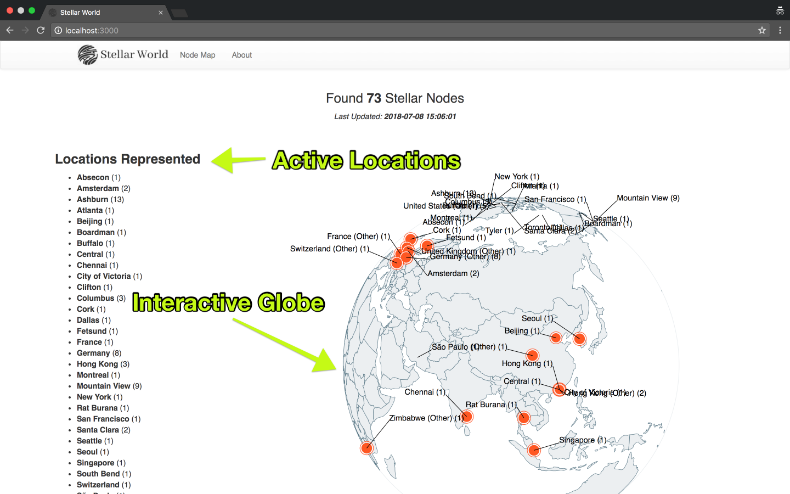
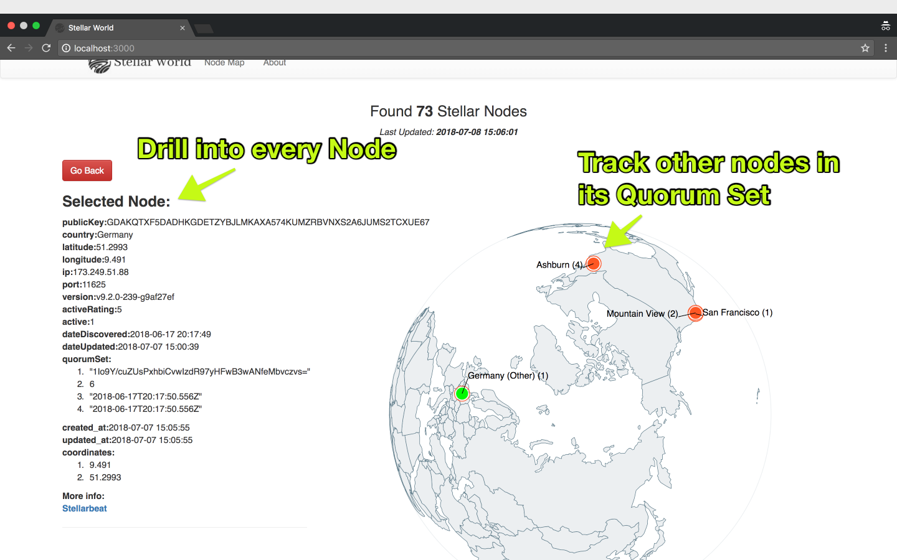

  

# Stellar World
---

Live Globe Visualization of active Stellar Nodes and Quorum sets.

Built as an extension and based on the data provided by <a href="stellarbeat.io">stellarbeat.io</a> - could possibly address  the Stellar Build Challenge (SBC) Task 1: Extending and Improving visualizations around qsets on the Stellar network.

## How to use

This project contains both a client and server side component. You will need to be running both in order to successfully use this app.

### Server Side:
Run the following from the `/server` directory

<pre>
  yarn && yarn start
</pre>

The Stellar World server should not be running on app 3001. 

### Client Side:

Install dependencies for the client app.
<pre>
    yarn
</pre>

Build the project and start the server
<pre>
    yarn build && yarn start
</pre>

The app should now be running on port 3000.  

Open `localhost:3000` from your favorite web browser with the server running to use.

### Screenshots:

### Quorums Sets and Validators

The Stellar Consensus Protocol (SCP) is a construction for federated Byzantine agreement, a new approach to consensus.

#### What is distributed consensus?
In a distributed system, all nodes must periodically update the state that they’re replicating — for example, a transaction ledger. We identify each update by a unique slot; a consensus protocol ensures that all nodes agree upon slot content.

When nodes decide that an update is safe to apply, they externalize, or publish, the agreed-upon statement to their replica of the ledger. Consensus is reached when all nodes update their ledgers and externalize the same value.

#### Tolerating Byzantine failure
We want to ensure consensus even when individual nodes act arbitrarily, behavior known as Byzantine failure. To tolerate Byzantine failure, SCP is designed not to require unanimous consent from the complete set of nodes for the system to reach agreement, and to tolerate nodes that lie or send incorrect messages.

Quorum slices: introducing federation
In a distributed system, a quorum is a set of nodes sufficient to reach agreement. Federated Byzantine agreement introduces the concept of a quorum slice, the subset of a quorum that can convince one particular node of agreement.

#### Validating Nodes

Nodes are considered validating if they take part in SCP and sign messages pledging that the network agreed to a particular transaction set. It isn’t necessary to be a validator. Only set your node to validate if other nodes care about your validation.

#### Quorum Set Thresholds

Picking thresholds
Thresholds and groupings go hand in hand, and balance:

liveness - network doesn’t halt when some nodes are missing (during maintenance for example)
safety - resistance to bad votes, some nodes being more important (full validators) for the normal operation of the network
Liveness pushes thresholds lower and safety pushes thresholds higher.

On the safety front, ideally any group (regardless of its composition), can suffer a 33% byzantine failure, but in some cases this is not practical and a different configuration needs to be picked.

### Demo Flow:
* Intro to Stellar and the SCP (Stellar Consensus Protocol).
* Discussion of existing visualization solutions.
* Stellar World.
* Where this can be applied, importance.
* Future Work.

### Other Links:
* https://www.stellarbeat.io